# Common Git Terms

## Repository
A repo or repository is a container or bucket for a specific code project. It's also a bit of a database. It stores the "card catalog" for commits, revisions, branches, and remote repositories.

## Branch
A branch is a parallel version of a repository. It is contained within the repository but does not affect the primary or main branch, allowing you to work on different versions of a project simultaneously.

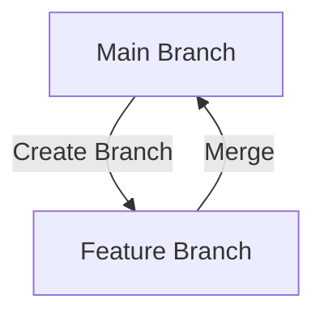

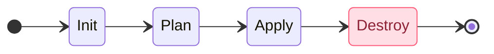

## Commit
A commit is a snapshot of your repository at a specific point in time. It records changes to the files and directories in the repository, allowing you to track the history of your project.

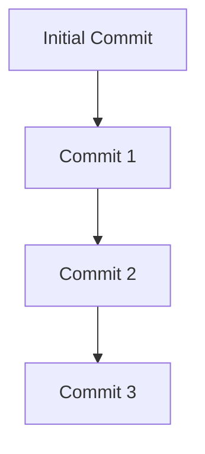

## Merge
Merging is the process of combining changes from different branches into a single branch. This is typically done to integrate new features or bug fixes into the main branch.

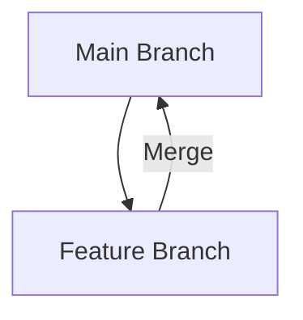

## Clone
Cloning is the process of creating a copy of an existing repository. This allows you to work on a project locally and make changes without affecting the original repository.

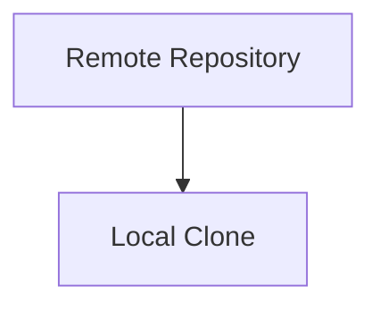

## Pull Request
A pull request is a way to propose changes to a repository. It allows you to notify others about changes you've made and request that they be merged into the main branch.

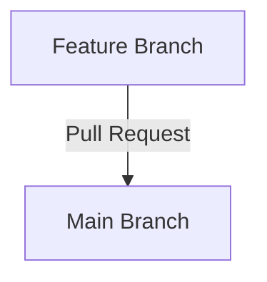

## Remote
A remote is a version of your repository that is hosted on the internet or another network. It allows you to collaborate with others by pushing and pulling changes to and from the remote repository.

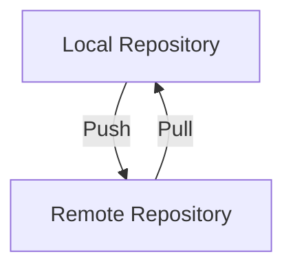

## Staging Area
The staging area is a place where you can prepare changes before committing them. It allows you to review and modify changes before they become part of the repository's history.

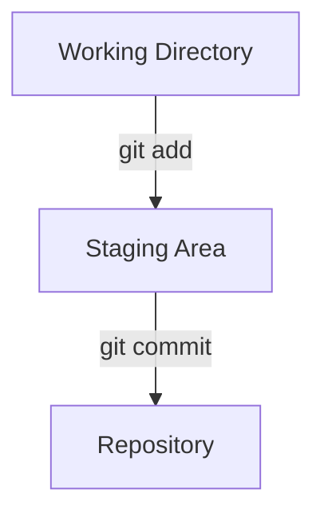

## Checkout
Checking out a branch or commit means switching to that branch or commit in your working directory. This allows you to view and work on different versions of your project.

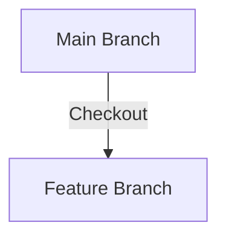

## Rebase
Rebasing is the process of moving or combining a sequence of commits to a new base commit. It is often used to keep a clean and linear project history.

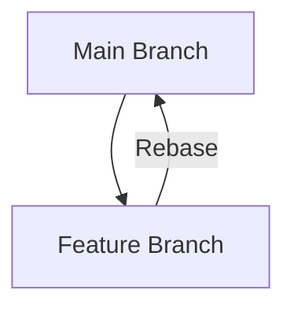

## Fork
A fork is a personal copy of someone else's repository. It allows you to freely experiment with changes without affecting the original project.

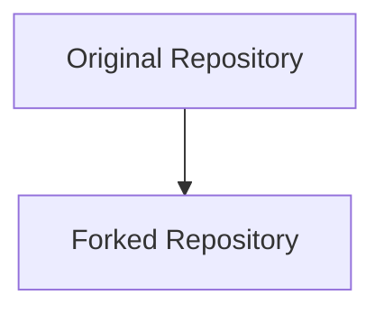

## HEAD
HEAD is a reference to the current commit or branch that you are working on. It points to the latest commit in your current branch.

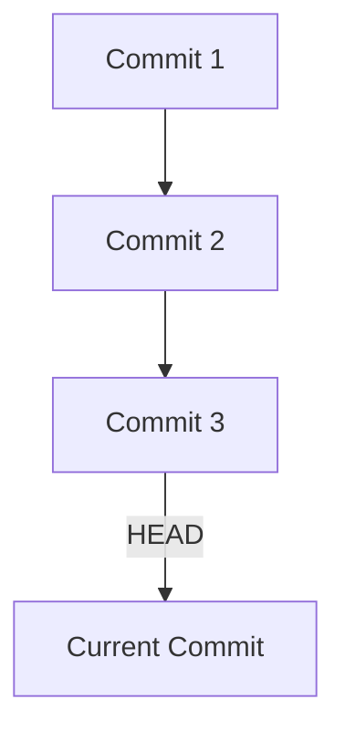

## Tag
A tag is a reference to a specific point in the repository's history. It is often used to mark release points or other significant milestones.

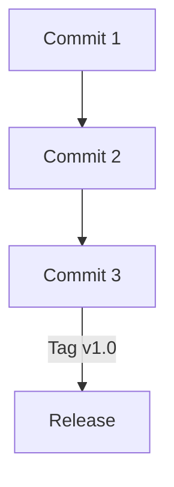

## Diff
A diff is a comparison of changes between two commits, branches, or files. It shows what has been added, modified, or deleted.

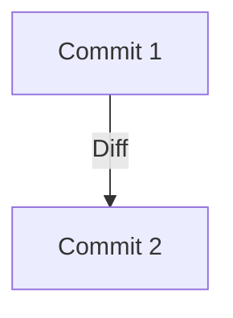

## Conflict
A conflict occurs when changes from different branches cannot be automatically merged. It requires manual resolution to integrate the changes.

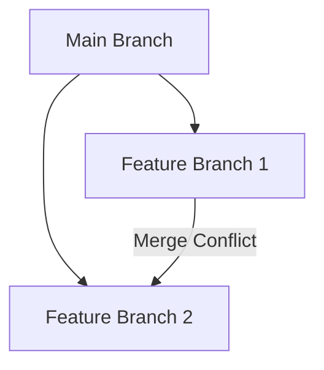

## Fetch
Fetching is the process of downloading changes from a remote repository without integrating them into your local repository. It allows you to see what others have been working on.

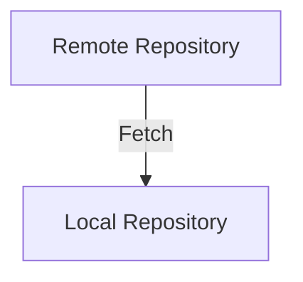

## Push
Pushing is the process of uploading your local changes to a remote repository. It allows others to access and collaborate on your work.

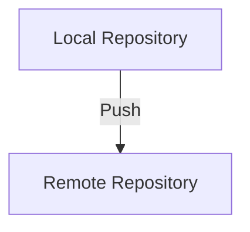

## Pull
Pulling is the process of downloading changes from a remote repository and integrating them into your local repository. It combines fetching and merging in one step.

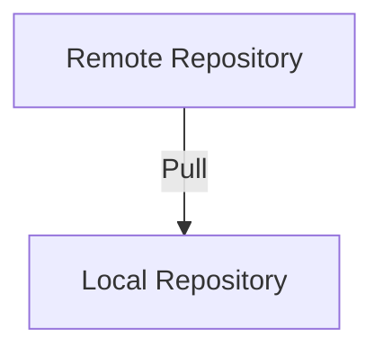

## Blame
Blame is a feature that shows who made changes to a file and when. It is useful for tracking down the origin of specific changes.

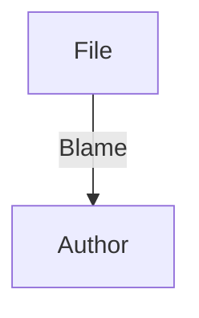

## Submodule
A submodule is a repository embedded inside another repository. It allows you to include and manage dependencies as part of your project.

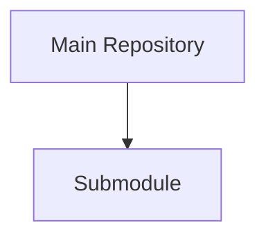

## Cherry-pick
Cherry-picking is the process of applying a specific commit from one branch to another. It allows you to selectively integrate changes without merging entire branches.

```mermaid
graph TD;
    A[Commit 1] --> B[Commit 2];
    B -->|Cherry-pick| C[Feature Branch];
```

## Gitignore
A \`.gitignore\` file specifies which files and directories should be ignored by Git. It prevents unnecessary files from being tracked and included in the repository.

```mermaid
graph TD;
    A[Working Directory] -->|.gitignore| B[Ignored Files];
```

## Revert
Reverting is the process of creating a new commit that undoes changes from a previous commit. It allows you to roll back changes without modifying the project history.

```mermaid
graph TD;
    A[Commit 1] --> B[Commit 2];
    B -->|Revert| C[Commit 3];
```

## Squash
Squashing is the process of combining multiple commits into a single commit. It is often used to clean up a branch before merging it into the main branch.

```mermaid
graph TD;
    A[Commit 1] --> B[Commit 2];
    B -->|Squash| C[Single Commit];
```

## Stash
Stashing is the process of temporarily saving changes that are not ready to be committed. It allows you to switch branches or work on other tasks without losing your work.

```mermaid
graph TD;
    A[Working Directory] -->|git stash| B[Stash];
    B -->|git stash apply| A;
```

## Subtree
A subtree is a way to include a repository as a subdirectory of another repository. It allows you to manage dependencies and integrate changes more easily.

```mermaid
graph TD;
    A[Main Repository] --> B[Subtree];
```

## Workflow
A workflow is a set of guidelines and practices for using Git in a project. It defines how branches, commits, and merges should be managed to ensure a smooth development process.

```mermaid
graph TD;
    A[Feature Branch] -->|Merge| B[Main Branch];
    B -->|Release| C[Production];
```